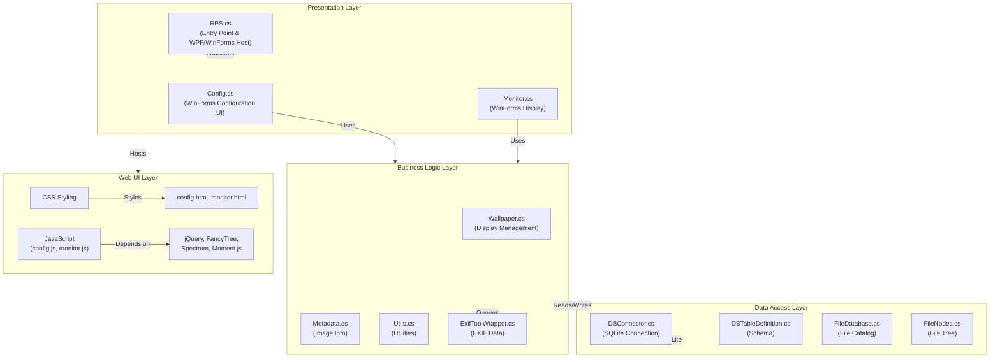

Random Photo Screensaver(tm) 4
==========================

Random Photo Screensaver 4 (RPS4) is a photo slideshow screensaver written in Visual Studio C#, now upgraded to .NET 10 (LTS). 

Download / preview
------------------
You can download the latest executable for Windows 10/11 from [abScreensavers.com](http://www.abscreensavers.com/random-photo-screensaver). This also showcases some of its many features.

Structure
---------
RPS consists of two programs. A [launcher](https://github.com/marijnkampf/Random-Photo-Screensaver/tree/master/RPS%20Launcher) that resides in the users' Windows folder and the actual [Random Photo Screensaver](https://github.com/marijnkampf/Random-Photo-Screensaver/tree/master/RPS%204) program that resides in the installation folder including all required libraries. 

I've chosen for this option as it avoids cluttering the Windows folder with loads of files, makes installation of library files easier and avoids creating conflicts with existing library files.

Installation
------------
If you only want to use the screensaver download the latest executable from [abScreensavers.com](http://www.abscreensavers.com/random-photo-screensaver). 

**System Requirements:**
- Windows 10 or later (Windows 11 recommended)
- .NET 10 Runtime or later (LTS - Long Term Support)
- Modern web browser components (Microsoft Edge WebView2)

**Legacy Version:** For Windows 7/8/8.1 support, use the older .NET Framework 4.7.2 version available in the release history.

Compiling from source
---------------------
The following instructions are for compiling RPS from source in Microsoft Visual Studio 2022 or later. The Community Edition can be downloaded for free from: https://visualstudio.microsoft.com/downloads/

**Requirements:**
- Visual Studio 2022 or later
- .NET 10 SDK (LTS)
- Windows 10/11 SDK

**Steps:**
- Download the source files from https://github.com/marijnkampf/Random-Photo-Screensaver/tree/RPS4
- Open RPS 4.sln
- Restore NuGet packages
- Build solution

History
-------
- 2005: RPS 1 & 2 written in Delphi
- 2008: RPS 3 written in Visual Studio C++
- 2014: RPS 4 written in Visual Studio C#
    - See http://www.abscreensavers.com/random-photo-screensaver/version-information/ for full list of 4.X releases.
- **2025: RPS 4 upgraded to .NET 10 (LTS)**
    - Modern SDK-style project format
    - Security updates (Newtonsoft.Json CVE-2024-30105 fixed)
    - Compatible SQLite packages
    - Removed obsolete Code Access Security
    - Windows 10/11 optimized

Design rationale
----------------
This is the second complete rewrite of RPS in almost 10 years. When I choose for C++ in 2008 I had performance in mind most of all. I however found that there are far more code examples for C# and that the performance between C++ and C# doesn't differ that much for a screensaver application.

I'm a [web developer](http://www.exadium.com) by day and software developer at night, basing the display on browser technology should make it easier for 3rd parties to develop plugins for things as transitions and other features. How the photos are shown should be completely customised in the final RPS 4 version.

## Structure

### Folder Organization
```
Random-Photo-Screensaver/
??? RPS Launcher/              # Windows folder resident launcher (minimal footprint)
?   ??? RPS Launcher.sln       # Separate project for launcher
??? RPS 4/                     # Main screensaver installation folder
    ??? RPS 4.csproj           # SDK-style .NET 10 project
    ??? data/                  # Web UI resources
    ?   ??? config.html        # Configuration interface
    ?   ??? monitor.html       # Display/preview interface
    ?   ??? css/               # Styling
    ?   ??? js/                # Client-side logic & effects
    ?   ??? vendor/            # Third-party libraries (jQuery, FancyTree, etc.)
    ??? vendor/                # Runtime dependencies (exiftool.exe)
```

**User Data Locations:**
- **Settings**: `%programdata%\Random Photo Screensaver\` (system-wide)
  - `settings.sqlite` - User preferences
  - `store.sqlite` - Cached metadata
  - `meta.sqlite` - Image metadata cache
- **Alternative**: `%localappdata%\Random Photo Screensaver\` (user-specific overrides)

### .NET Project Architecture

**RPS 4** is a modern **Windows Desktop Application** (.NET 10 LTS) with a layered architecture:



**Key Component Roles:**

| Component | Purpose | Technology |
|-----------|---------|-----------|
| **RPS.cs** | Main entry point, application lifecycle | .NET WinForms/WPF |
| **Config.cs & Monitor.cs** | User interfaces for configuration and preview | WinForms Windows Forms |
| **Wallpaper.cs** | Display and rendering management | Windows API interop |
| **DBConnector.cs** | SQLite database abstraction layer | System.Data.SQLite |
| **FileDatabase.cs** | Photo catalog and indexing | LINQ to Objects |
| **ExifToolWrapper.cs** | External EXIF metadata extraction | Process wrapper for exiftool.exe |
| **Web UI (HTML/JS)** | Browser-based configuration interface | Embedded browser engine |

**Project Configuration:**
- **Target Framework**: `net10.0-windows` (SDK-style project)
- **Output Type**: `WinExe` (Windows desktop application)
- **UI Frameworks**: Both WinForms & WPF support enabled
- **Architecture**: x86 (32-bit) optimized for screensaver compatibility
- **Key Features**:
  - Modern C# language features (nullable reference types, pattern matching)
  - Windows Forms desktop UI + embedded web UI
  - SQLite for local data persistence
  - EXIF metadata extraction via external tool
  - Multi-monitor support
  - Photo slideshow with transition effects

**RPS Launcher** is a separate, lightweight Windows Screensaver Launcher that:
- Resides in the Windows system folder (`%Windows%\System32\`)
- Launches the main RPS 4 application with minimal footprint
- Separates screensaver registration from core functionality
- Keeps Windows folder clean from application libraries

Credits
-------
See http://www.abscreensavers.com/random-photo-screensaver/configuration/?tab=credits for a full list of credits of software, libraries and other code used in the making of RPS.

License
-------
Copyright (C) 2005-2020 Marijn Kampf <marijn (at) abscreensavers (dot) com>

Random Photo Screensaver(tm) is free software (http://www.gnu.org/philosophy/free-sw.html); you can redistribute it and/or modify it under the terms of the GNU General Public License (http://www.gnu.org/licenses/gpl.html) as published by the Free Software Foundation; either version 3 of the License, or (at your option) any later version.

The Random Photo Screensaver, abScreensavers.com names and logos are trademarks and may not be used in third party releases without written permission. See [list of trademarks](http://www.abscreensavers.com/random-photo-screensaver/open-source/trademarks). In short, if you release a separate version you have to change the name and logos of your screensaver.

Alternatively, Random Photo Screensaver is also available with a commercial license, which allows it to be used in closed-source projects. Contact me (http://www.abscreensavers.com/contact) for more information.

Random Photo Screensaver is distributed in the hope that it will be useful, but WITHOUT ANY WARRANTY; without even the implied warranty of MERCHANTABILITY or FITNESS FOR A PARTICULAR PURPOSE.

See http://www.abscreensavers.com for more information.

Random Photo Screensaver 3
--------------------------
The source for the previous version RPS3 written in Visual Studio C++, can be found at https://github.com/marijnkampf/Random-Photo-Screensaver/tree/RPS3. It will only be updated with bug fixes no new features are added.
